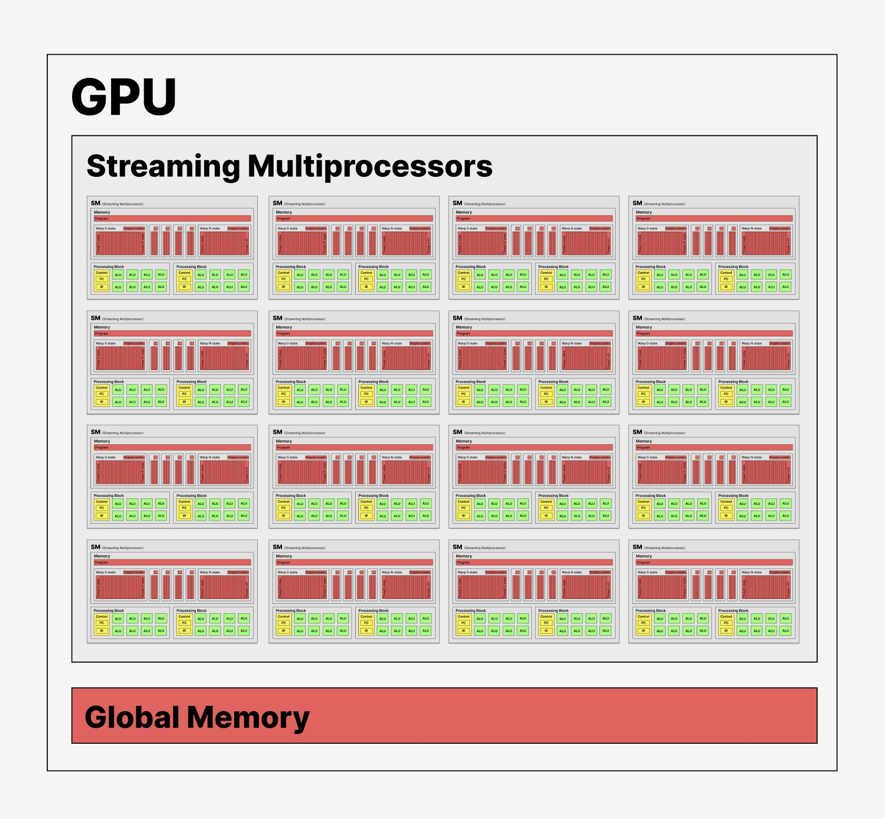
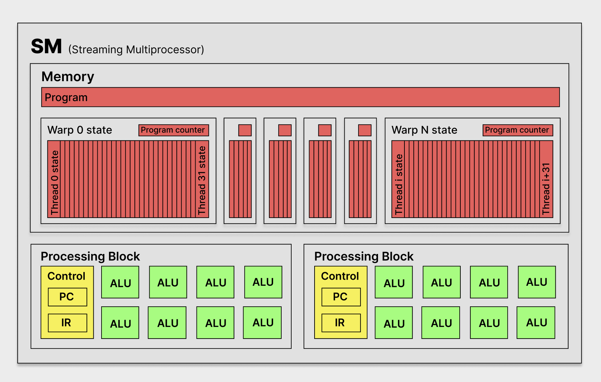

# Chapter 4: Compute architecture and scheduling
1. [Architecture of a modern GPU](#41-architecture-of-a-modern-gpu)
2. [Block scheduling](#42-block-scheduling)
3. [Synchronization and transparent scalability](#43-synchronization-and-transparent-scalability)
4. [Warps and SIMD hardware](#44-warps-and-simd-hardware)
5. [Control divergence](#45-control-divergence)
6. [Warp scheduling and latency tolerance](#46-warp-scheduling-and-latency-tolerance)
7. [Resource partitioning and occupancy](#47-resource-partitioning-and-occupancy)
8. [Querying device properties](#48-querying-device-properties)





## 4.1 Architecture of a modern GPU
- Each GPU has an array of **SM**s (Highly-Threaded Streaming Multiprocessors)

- Each SM has several processing units called streaming processors or **CUDA cores**

    - Ampere A100 GPUs have 108 SMs with 64 cores each

- Each SM has its own on-chip memory unit

- **Memory** consists of the SMs' on-chip memory units

- **Global Memory** is the GPU's DRAM, which is off-chip
    - Old GPUs used [double data rate synchronous DRAM](https://en.wikipedia.org/wiki/Double_data_rate)

    - New GPUs use HBM ([high-bandwidth memory](https://en.wikipedia.org/wiki/High_Bandwidth_Memory)) or HBM2


## 4.2 Block scheduling
- All threads in a block are assigned to the same SM

- Multiple blocks can be assigned to the same SM

- Each SM can only execute so many blocks at once

- The runtime system keeps a list of blocks that are waiting

- After an SM executes a group of blocks, the runtime will assign a new group of blocks to it

- All threads in a block are scheduled simultaneously on the same SM

    - Because of this, threads in the same block can interact with **barrier synchronization**, which is communication via **shared memory** located on the SM

    - Threads in different blocks can interact with the [Cooperative Groups API](https://developer.nvidia.com/blog/cooperative-groups)


## 4.3 Synchronization and transparent scalability
- Threads in the same block can coordinate using the barrier synchronization function `__syncthreads()`

- When a thread calls `__syncthreads()`, it will halt until all other threads in its block reach that step

- If a kernel calls `__syncthreads()`, each thread in a block must reach the call

    - If it's in one of the blocks of an if statement, each thread in the same block must run the same path, either if-then or if-else

- The following is faulty kernel code, since it defines two distinct barriers
    ```c
    if (threadIdx.x % 2 == 0) {
        __syncthreads();
    } else {
        __syncthreads();
    }
    ```

- Incorrect barrier synchronization may cause:
    - Undefined execution behavior
    - Incorrect results
    - **Deadlock** (threads waiting forever for each other)

- Since threads in different can't perform barrier synchronization, GPUs can execute the blocks in any order


## 4.4 Warps and SIMD hardware
- Threads in a block can execute in any order

- Multi-phase algorithms should separate the phases with barrier synchronization

- Once a block has been assigned to an SM, it is divided into 32-thread units called **warps**

- If a block has a dimension that's not a multiple of 32, the last warp will be padded with threads that do nothing

- If a block has multiple dimensions of threads, the threads are linearized in row-major order before being divided into warps

- **SIMD**: Single-instruction, multiple-data model
    - A thread will not move on to the next instruction until all other threads in its same warp have also completed its current instruction

- Cores in the SM are divided into **processing blocks**
    - The number of cores per processing block differs between GPU models
    - Ampere A100: SMs have 4 processing blocks, and 16 cores per processing block

- All threads in a warp are assigned to the same processing block

- There are usually fewer than 32 cores within a processing block, and yet, there are 32 threads assigned to each processing block. To make it seem like all of the threads are executing the same instruction at the same time, each core switches between threads until they're all done the instruction

- The **fetch/dispatch unit** is responsible for loading the current instruction. With SIMD, since many cores execute the same instruction, there can be fewer & smaller fetch/dispatch units


## 4.5 Control divergence

Within the same warp, if some threads follow an if-then path and some follow an if-else path, then the SM passes over each instruction in both paths, only executing the "active" threads in each path.

It's more efficient when all threads in the same warp follow the same control flow, because then the hardware skips the unused path.

In the vector addition example, the only warp with control divergence is the one containing threads with both `i < N` and `i >= N`

From the Volta architecture onward, a single warp can schedule each thread independently, so that the if-then path as well as the if-else path run concurrently.


## 4.6 Warp scheduling and latency tolerance

Multiple warps can be assigned to an SM at the same time.

An SM usually has more threads assigned to it than it has cores, and so they have to multi-task.

### Latency tolerance
If a warp awaits a long-latency operation, the SM puts that warp on hold and executes another warp.

If more than one warp is ready for execution, a priority mechanism is used to select one.

The more threads there are assigned to a core, the more likely it is there will be a warp ready for execution.

### Threads and context-switching
A thread consists of:
1. Sequence of instructions
2. Current location in the sequence (PC)
3. Current values of the variables (in memory)

The **PC** (program counter) is a pointer storing the address of the current instruction.

The **IR** (instruction register) stores the value of the current instruction.

IR and memory hold the variables' values.

A CPU can **context-switch** by saving and and restoring a thread's PC, IR, and memory to resume execution later. This costs extra processor cycles.

### Zero-overhead scheduling
An SM's on-chip memory stores the current state of each warp assigned to it, so it can schedule its cores to context-switch without needing to load/unload thread state.

<br>


## 4.7 Resource partitioning occupancy
**Occupancy** is the ratio of warps assigned to an SM to the maximum number of warps it supports.

Occupancy should be as high as possible for latency tolerance. Make sure the threads don't use too much local memory - if they do, warps will have to be moved to other SMs.

[CUDA Occupancy Calculator](https://xmartlabs.github.io/cuda-calculator/) shows the occupancy given the threads per block, registers per thread, and shared memory per thread.

## 4.8 Querying device properties
To get the number of devices in the system, use the following:
```c
int devCount;
cudaGetDeviceCount(&devCount);
```

Each device is numbered from `0` to `devCount-1`. To get a device's information, use

```c
cudaDeviceProp devProp;
for (unsigned int i = 0; i < devCount; i++) {
    cudaGetDeviceProperties(&devProp, i);
    // Check the device properties
}
```

`cudaDeviceProp` is a struct type with fields describing the CUDA device. ([docs](https://docs.nvidia.com/cuda/cuda-runtime-api/structcudaDeviceProp.html))

Some of the properties are as follows.

```c
int devProp.maxThreadsPerBlock;
int devProp.multiProcessorCount; // number of SMs in the device
int devProp.clockRate; // deprecated. Combined with # of SMs, gives approximation to max throughput
int devProp.maxThreadsDim[0]; // max threads per block in dimension x
int devProp.maxThreadsDim[1]; // max threads per block in dimension y
int devProp.maxThreadsDim[2]; // max threads per block in dimension z
int devProp.maxGridSize[0]; // max blocks per grid in dimension x
int devProp.maxGridSize[1]; // max blocks per grid in dimension y
int devProp.maxGridSize[2]; // max blocks per grid in dimension z
int devProp.regsPerBlock; // number of registers in each SM
int devProp.warpSize; // number of threads per warp
// ... many more
```