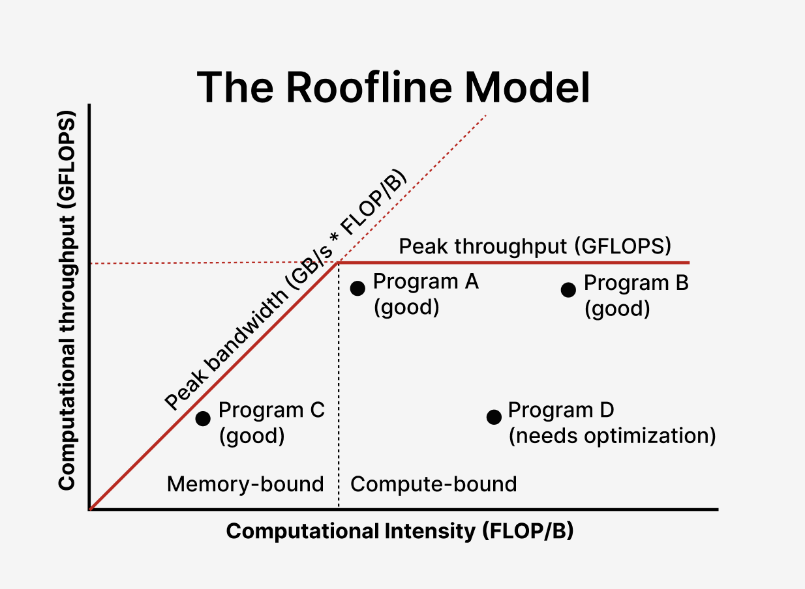

# Chapter 5: Memory architecture and data locality

- [Chapter 5: Memory architecture and data locality](#chapter-5-memory-architecture-and-data-locality)
  - [5.1 Importance of memory access efficiency](#51-importance-of-memory-access-efficiency)
  - [5.2 CUDA memory types](#52-cuda-memory-types)
    - [Local memory](#local-memory)
    - [Registers](#registers)
    - [Shared memory](#shared-memory)
    - [CUDA declarations](#cuda-declarations)
  - [5.3 Tiling for reduced memory traffic](#53-tiling-for-reduced-memory-traffic)
    - [Tiling](#tiling)
  - [5.4 A tiled matrix multiplication kernel](#54-a-tiled-matrix-multiplication-kernel)
  - [5.5 Boundary checks](#55-boundary-checks)

<br>

If many SMs are trying to access global memory, there might be congestion. This might slow down threads.

It's better to save some of the global memory to local memory to avoid this congestion.

<br>


## 5.1 Importance of memory access efficiency

Here's the iteration part of our matrix multiplication kernel.

```c
for (int k = 0; k < N; k++) {
    C_ij += A[i * N + k] * B[k * N + j];
}
```

In each iteration, there are two global memory accesses, and two floating-point arithmetic operations (FLOPs).

The ratio of FLOPs to bytes accessed from global memory is **2FLOP / 8B = 0.25 FLOP/B**.

Names for this are:
- **Compute to global memory access ratio**
- **Arithmetic intensity**
- **Computational intensity**

The Ampere A100's global memory's max bandwidth is 1555 GB/s. Since the arithmetic intensity of matmul is 0.25 OP/B, a kernel's maximum throughput is **388 GFLOPS (giga FLOPs per second)**.

That's only 2% of the A100's peak throughput for single-precision ops, which is **19,500 GFLOPS**.

The A100 also comes with **tensor cores**, which accelerate matmul. Including the tensor cores, the A100's peak single-precision floating-point throughput is actually **156,000 GFLOPS**.

So the matmul kernel is a **memory-bound** program.

We can use the **Roofline Model** to classify a program's performance. The red lines represent the GPU's hardware limits. An optimal program will lie close to these limits.



<br>


## 5.2 CUDA memory types

**Global memory (RW)** and **constant memory (R)** are stored in the off-chip DRAM.


### Local memory
Each thread has its own section of global memory that it uses as its own personal local memory (RW), which no other thread can access.

### Registers
- On-chip memory
- Bandwidth is about 2 orders of magnitude higher than global memory
- Allows for reduced usage of global memory bandwidth
- Accesses require fewer instructions than global memory
- Accesses don't require a load instruction
- Use these carefully! Registers are a limited resource

### Shared memory
- On-chip memory
- Requires a load instruction, so accesses are slightly slower than register accesses
- Each thread in the same block can access the same shared memory

**Texture memory** is another type of CUDA memory, not covered in this textbook. This stores information for graphically rendering textures.

### CUDA declarations

| Memory   | Variable declaration keyword          | Scope  | Lifetime    |
| -------- | ------------------------------------- | ------ | ----------- |
| Register | Automatic variables other than arrays | Thread | Grid        |
| Local    | Automatic variable arrays             | Thread | Grid        |
| Shared   | `__device__ __shared__`               | Block  | Grid        |
| Global   | `__device__`                          | Grid   | Application |
| Constant | `__device__ __constant__`             | Grid   | Application |

- Global memory: large but slow
- Shared memory: fast but small

<br>


## 5.3 Tiling for reduced memory traffic

### Tiling
Divide the dataset into **tiles**, and assign each block to a tile.

Load the tile into the block's shared memory.

Blocks must be able to process their tiles independently of each other.

<br>


## 5.4 A tiled matrix multiplication kernel
In multiplying 4x4 matrices A and B:

- We split A and B into 2x2 tiles.

- We use 2x2 blocks.

- To start, each thread sets `res = 0`

- We divide the algorithm into two phases. In each phase:
  - Each thread loads one element of the current tile into shared memory
  - Each thread performs 2 multiplications and 2 additions into `res`

- Set memory to `res`

In general, using this approach with Width x Width blocks speeds matmul up by Width.


The following is a kernel with 16x16 tiles.

```c
#define TILE 16
__global__ matmul(float* A, float* B, float* C, int N) { // linearized 2x2 matrices
    __device__ __shared__ float As[TILE][TILE];
    __device__ __shared__ float Bs[TILE][TILE];

    int bx = blockIdx.x,  by = blockIdx.y;
    int tx = threadIdx.x, ty = threadIdx.y;

    int i = by*TILE + ty;
    int j = bx*TILE + tx;

    int C_ij = 0;
    for (int ph = 0; ph < N / TILE; ph++) {
        // Collaborative loading of tile elements
        As[ty][tx] = A[i*N + ph*TILE + tx];
        Bs[ty][tx] = B[(i + ph*TILE)*N + tx];
        __syncthreads(); // read-after-write dependence

        // Computing with tile values in shared memory
        for (int k = 0; k < TILE; k++) {
            C_ij += As[ty][k] * Bs[k][tx];
        }
        __syncthreads(); // write-after-read dependence
    }
    C[i*N + j] = C_ij;
}
```

This technique is also called *strip-mining* - splitting a long loop into phases that can run faster

Strip mining is also popular in CPU programming.


## 5.5 Boundary checks
The previous kernel assumes that the matrix is square with width being a multiple of the block width. This is not generally the case. The following generalizes our tiling matmul algorithm.

```c

#define TILE 16
__global__ matmul(
    float* A, // linearized MxN matrix
    float* B, // linearized NxM matrix
    float* C, // linearized MxM matrix
    int M,
    int N
) {
    __device__ __shared__ float As[TILE][TILE];
    __device__ __shared__ float Bs[TILE][TILE];

    int bx = blockIdx.x,  by = blockIdx.y;
    int tx = threadIdx.x, ty = threadIdx.y;

    int i = by*TILE + ty;
    int j = bx*TILE + tx;

    int C_ij = 0;
    for (int ph = 0; ph < (N + TILE - 1) / TILE; ph++) {
        // Collaborative loading of tile elements
        if (i < M && ph*TILE+tx < N) {
            As[ty][tx] = A[i*N + ph*TILE + tx];
        } else {
            As[ty][tx] = 0.0f;
        }

        if (ph*TILE+ty < M && j < N) {
            Bs[ty][tx] = B[(i + ph*TILE)*N + tx];
        } else {
            Bs[ty][tx] = 0.0f;
        }
        __syncthreads(); // read-after-write dependence

        // Computing with tile values in shared memory
        for (int k = 0; k < TILE; k++) {
            C_ij += As[ty][k] * Bs[k][tx];
        }
        __syncthreads(); // write-after-read dependence
    }
    C[i*N + j] = C_ij;
}
```